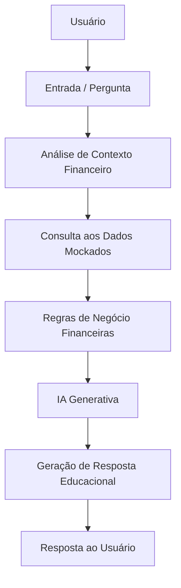

# 🤖 Finn — Educador Financeiro Inteligente

Finn é um **agente de IA generativa com foco em educação financeira**, desenvolvido como solução final do laboratório **“BIA do Futuro”** da Digital Innovation One (DIO).

O projeto entrega uma solução funcional que une **documentação, dados, prompts e código**, indo além do template inicial do fork e consolidando o desenvolvimento completo do agente.

---

## 🎯 Objetivo do Projeto

Criar um agente inteligente capaz de:

- Interpretar dados financeiros e perfil do usuário;
- Atuar como educador financeiro, não apenas como respondedor de perguntas;
- Gerar orientações claras, contextualizadas e didáticas;
- Demonstrar, na prática, o uso de **IA Generativa aplicada a um domínio real**.

---

## 🧠 O Agente: Finn

O **Finn** foi concebido como um educador financeiro digital, com comportamento orientado a:

- Análise de contexto financeiro;
- Comunicação simples e acessível;
- Geração de insights acionáveis;
- Apoio à tomada de decisão consciente.

Ele utiliza dados mockados e regras de negócio para simular cenários reais de uso.

---

## Estrutura do Repositório

```
📁 lab-agente-financeiro/
│
├── 📄 README.md
│
├── 📁 data/                          # Dados mockados para o agente
│   ├── historico_atendimento.csv     # Histórico de atendimentos (CSV)
│   ├── perfil_investidor.json        # Perfil do cliente (JSON)
│   ├── produtos_financeiros.json     # Produtos disponíveis (JSON)
│   └── transacoes.csv                # Histórico de transações (CSV)
│
├── 📁 docs/                          # Documentação do projeto
│   ├── 01-documentacao-agente.md     # Caso de uso e arquitetura
│   ├── 02-base-conhecimento.md       # Estratégia de dados
│   ├── 03-prompts.md                 # Engenharia de prompts
│   ├── 04-metricas.md                # Avaliação e métricas
│   └── 05-pitch.md                   # Roteiro do pitch
│
├── 📁 src/                           # Código da aplicação
│   └── app.py                        # O próprio aplicativo do Finn
│
├── 📁 assets/                        # Imagens e diagramas, vulgo, vazia
│   └── ...
│
└── 📁 examples/                      # Referências e exemplos, vazia
    └── README.md
```

Essa organização separa claramente **documentação, dados e implementação**, facilitando manutenção e evolução do projeto.

---

## 🔄 Fluxo de Funcionamento do Finn (Mermaid)

O diagrama abaixo representa o fluxo lógico do agente, desde a entrada do usuário até a resposta final:


---

## 🛠️ Tecnologias e Conceitos Utilizados
- IA Generativa (LLMs)
- Engenharia de Prompt
- Simulação de dados financeiros
- Organização de projeto orientada a produto
- Prototipação de agentes inteligentes

---
## 🚀 Como Executar o Projeto

### 1. Clone este repositório:
```
git clone https://github.com/felip-000/dio-lab-bia-do-futuro.git
```

### 2. Acesse a pasta do projeto:
```
cd dio-lab-bia-do-futuro
```

### 3. Configure as dependências e variáveis necessárias:
```
pip install streamlit pandas requests
```

### 4. Execute o código presente em ```src/```:
```
py -m streamlit run .\src\app.py
```

---
📚 Contexto Educacional

Este projeto foi desenvolvido como parte de um laboratório prático da DIO, com foco em:
- Aplicação real de IA Generativa;
- Organização de um repositório profissional;
- Entrega de uma solução completa (documentação + código).
